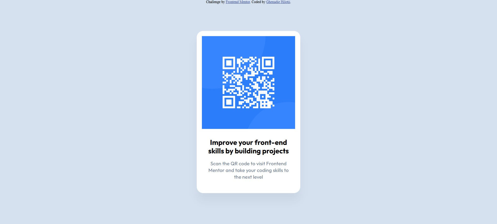

# Frontend Mentor - QR code component solution

This is a solution to the [QR code component challenge on Frontend Mentor](https://www.frontendmentor.io/challenges/qr-code-component-iux_sIO_H).

## Table of contents

- [Overview](#overview)
  - [Screenshot](#screenshot)
  - [Links](#links)
- [My process](#my-process)
  - [Built with](#built-with)
  - [What I learned](#what-i-learned)
  - [Continued development](#continued-development)
- [Author](#author)

## Overview

### Screenshot




### Links

- Solution URL: [Add solution URL here](https://your-solution-url.com)
- Live Site URL: [https://ghenadiedev.github.io/QR-code-component/](https://ghenadiedev.github.io/QR-code-component/)

## My process

### Built with

- Semantic HTML5 markup
- CSS3
- Flexbox

### What I learned

How I centered the div element horizontally and vertically

```css
.card {
  position: absolute;
  top: 50%;
  left: 50%;
  transform: translate(-50%, -50%);
}
```

### Continued development

This project was easy to develop and did not require special technologies or methodologies.
But as the projects become more complex, I will focus on compatibility with other browsers and on responsive design. I will most likely use technologies such as SCSS, JS, and Gulp. 
But that's for the future, but until then I'll use only HTML5 and CSS3.

## Author

- Frontend Mentor - [@GhenadieDev](https://www.frontendmentor.io/profile/GhenadieDev)
